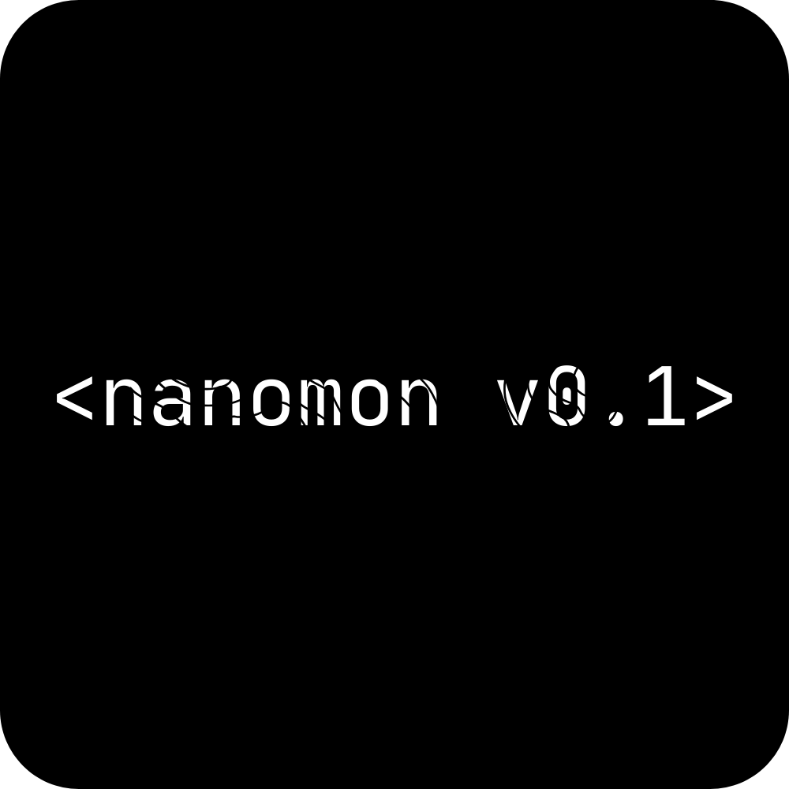
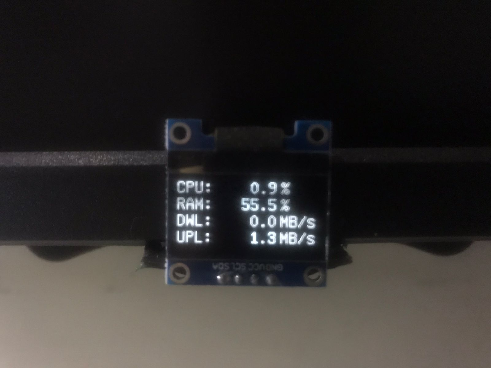
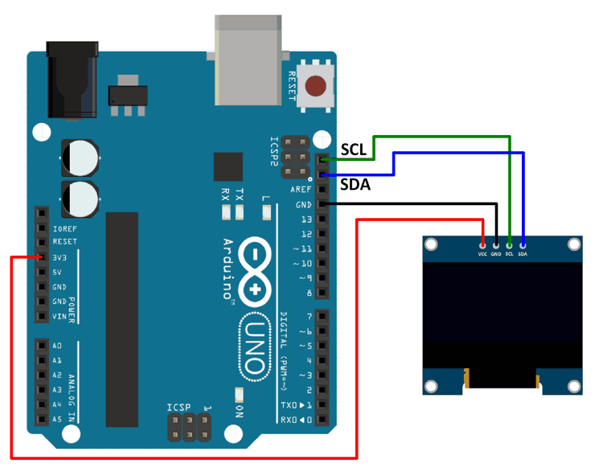

# NanoMon 
*An OLED system monitor for CPU, RAM, and Network usage*

<p align="center">
  
</p>

NanoMon is a cross-platform **Python + Arduino** project that monitors your **CPU load**, **RAM usage**, and **network upload/download speeds** in real time, and displays them on a **SSD1306 OLED**.  

It’s lightweight, fun, and shows a **welcome smiley 🙂** when it starts, plus a **goodbye 👋** message when you quit.

<p align="center">  </p>

---

## Features
- 📊 Displays CPU % and RAM % usage  
- 🌐 Shows live Download & Upload speeds (MB/s)
- 😃 Welcome message with a smiley face on startup    
- ⚡ Windows-only platform (Linux and MacOS platform for the next update)
- 🔌 Auto-detects serial port 
- 🖥️ Runs as a standalone executable (via PyInstaller)  

---

## Requirements
### Hardware
- ESP32 / Arduino(Atmega328) with SSD1306 OLED display (128×64)  
- USB cable for serial connection 
- Jumper cables 

### Software
- Python 3.9+  
- Libraries:
  ```bash
  pip install psutil pyserial
  ```
- Arduino IDE with **U8glib** or **U8g2** library

## Hardware Setup
### Wiring (SSD1306 I2C to Arduino(Atmega328)/ESP32)
| OLED Module Pin | Arduino | ESP32 |
|---|---|---|
| VCC | 5V | 3.3V / 5V |
| GND | GND | GND |
| SDA | A4 | GPIO 21 |
| SCL | A5 | GPIO 22 |
⚠️ On some ESP32 boards, SDA/SCL may differ — check your board specs.

### Electrical Diagram
<p align="center">  </p>

## Software Setup
### 1. Flash the Arduino/ESP32
Upload the Arduino sketch from arduino/ to your board.
This handles receiving serial data and rendering it on the OLED.

### 2. Run the Python Script
```bash
    python nanomonv01.py
```
or just run the .exe file.

The script collects system stats and streams them over serial to the board.

## License
MIT License — free to use, modify, and share.